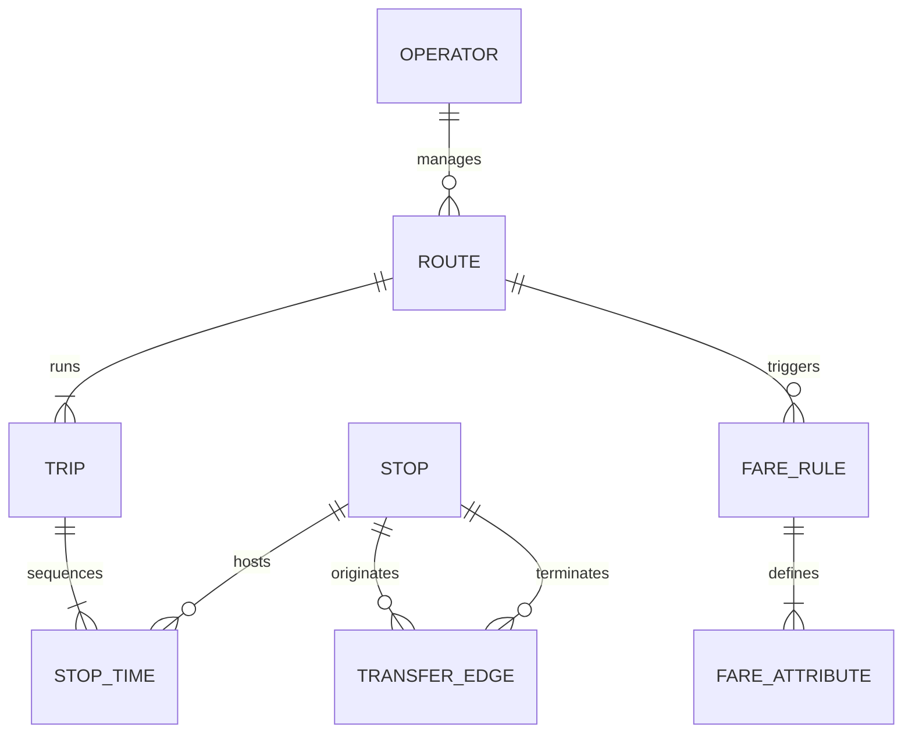
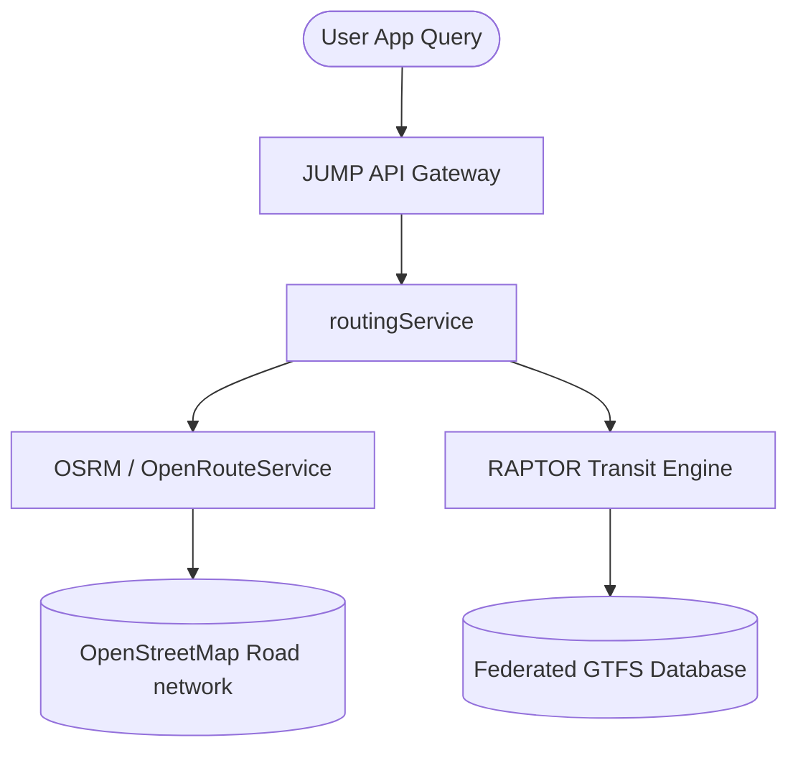

# JUMTA: Jaipur Urban Mobility and Transit Authority Platform 🚀

JUMTA (also referred to as **UMTAJ** in the system) is a next-generation **Mobility-as-a-Service (MaaS)** platform and transit routing engine built for the city of Jaipur. It is designed to unify diverse transit modes—including the JMRC Metro (Phase 1 & 2), JCTSL City Buses, e-rickshaw feeder services, cycle sharing, and pedestrian networks—into a single, seamless passenger portal.

With a motto of **"One City. One Ticket."**, JUMTA provides smart multi-modal routing, unified ticketing using cryptographically signed QR codes, real-time GPS tracking, and an AI-adaptive network controller for demand prediction.

---

## 📖 Table of Contents
1. [Key Features](#-key-features)
2. [Platform Architecture](#-platform-architecture)
3. [Technology Stack](#-technology-stack)
4. [Project Structure](#-project-structure)
5. [Routing & Validation Logic](#-routing--validation-logic)
6. [Getting Started](#-getting-started)
7. [Licensing & Support](#-licensing--support)

---

## ✨ Key Features

### 🗺️ Multi-Modal Pareto-Optimal Routing
- Computes optimized routes using a graph-based network model where physical stops represent vertices and connections (transit routes + pedestrian walks) represent directed edges.
- Supports **multi-criteria path optimization** based on time, fare, carbon footprint, congestion, and transfers.
- Implements route generation inspired by the **RAPTOR (Round-Based Public Transit Routing)** engine for schedules, and **A\* / Dijkstra** for road pathways.

### 🎫 Unified Ticketing & Dynamic Concessions
- Integrates ticketing across JMRC Metro and JCTSL Buses using a single cryptographically signed JWT QR code.
- Implements a **Dynamic Fare Engine** that applies automatic **20% intermodal discounts** on combined routes.
- Supports profile-based concessions:
  - **Resident**: Standard fares.
  - **Student**: 50% discount on Metro segments.
  - **Tourist**: Unified daily pass activation.

### 📍 High-Fidelity Real-Time GPS Tracking
- Simulates real-time telemetry for public transit buses using live shape plotting.
- Fetches real road coordinates and pedestrian routes dynamically from the **OSRM (Open Source Routing Machine)** API using OpenStreetMap (OSM) grid data.
- Animates passenger journey progress smoothly along winding street paths.

### 🧠 AI-Adaptive Demand Predictor
- Features an adaptive demand and ridership engine modeled around peak-hour factors, weather conditions (Clear, Rain, Hot Wave), and special events (Festivals, Exams, Melas).
- Emulates a Graph Neural Network (GNN) hotspot predictor to isolate station congestion and recommend mitigation routes.

### 🎛️ Control Center & Operator Dashboards
- Contains a real-time system monitoring control board.
- Allows operators to simulate peak load factors, change weather events, inject metro/bus delay variables, and review historical ridership trends.

---

## 🏗️ Platform Architecture

### Entity-Relationship (ER) Schema
The data layers relate transit operators, scheduled timetables, and physical routes together:



### API Gateway & Routing Strategy
The application combines open-source geocoding with local high-speed static schedules:



---

## 🛠️ Technology Stack
- **Frontend Core**: React 19, TypeScript, Vite
- **State Management**: Zustand
- **Animations**: Framer Motion (micro-interactions and screen transitions)
- **Styling**: Tailwind CSS & Custom CSS variables
- **Data Visualization**: Recharts (for control center analytics)
- **Icons**: Lucide React
- **Geographic Services**: OpenStreetMap (OSM), Nominatim reverse-geocoder, and Open Source Routing Machine (OSRM)

---

## 📂 Project Structure

```text
JUMTA/
├── public/                       # Static public assets
├── src/
│   ├── assets/                   # Images and styling assets
│   ├── data/                     # Local JSON Databases
│   │   ├── jctsl_routes.json     # JCTSL City Bus routes
│   │   ├── jctsl_stops.json      # Bus stop physical coordinates
│   │   ├── metro_phase1.json     # JMRC Phase 1 stations (Pink Line)
│   │   ├── metro_phase2.json     # JMRC Phase 2 stations (Orange Line)
│   │   ├── poi_locations.json    # Points of Interest (WTP, Forts, etc.)
│   │   └── interchange_nodes.json# Transfer/Walk connections (<250m)
│   ├── services/                 # Business & Routing Logic
│   │   ├── fareService.ts        # Concessions, wallet deductions & ticket logic
│   │   ├── predictionService.ts  # Weather & Event AI simulation
│   │   ├── routingService.ts     # Multi-modal path finder & OSRM wrapper
│   │   └── transitDataService.ts # Accessors for stops, routes, and POIs
│   ├── App.css                   # Custom viewport styles
│   ├── App.tsx                   # Main SPA Viewport (Simulator & Dashboards)
│   ├── index.css                 # Base styles and Tailwind config imports
│   ├── main.tsx                  # React DOM mount point
│   ├── store.ts                  # Zustand global MaaS store
│   └── algorithms.ts             # Multi-Criteria Dijkstra & AI Adaptive Engine
├── package.json                  # Dependencies and build scripts
├── vite.config.ts                # Vite project configurations
└── tsconfig.json                 # TypeScript rules and compilation setup
```

---

## 🛣️ Routing & Validation Logic

To prevent fictional routes (e.g., teleporting directly between unconnected stops), the engine validates paths using predefined walking links.

### Route Case Study: Mansarovar to MNIT
* **Start Coordinate**: Mansarovar ($26.8770^\circ\text{ N}, 75.7540^\circ\text{ E}$)
* **End Coordinate**: MNIT ($26.8662^\circ\text{ N}, 75.8079^\circ\text{ E}$)

As no direct public transit link exists between these locations, JUMTA resolves the multi-modal journey:


#### Calculated Journey Breakdown:
1. **Metro Leg**: Board JMRC Pink Line at Mansarovar station $\rightarrow$ Travel to Sindhi Camp Metro Station (14 minutes, ₹20).
2. **Transfer**: Walk from Metro Platform to Sindhi Camp JCTSL Bus Stop (80m, ~1.5 mins + 4 mins buffer).
3. **Bus Leg**: Board JCTSL Route 3 Bus $\rightarrow$ Disembark at MNIT Bus Stop (22 minutes, ₹15).
4. **Walk Leg**: Walk from bus stop to MNIT campus gate (30m, ~0.5 mins).
5. **MaaS Pricing**: ₹20 (Metro) + ₹15 (Bus) - ₹7 (20% Combined Ticket Discount) = **₹28 total fare**.

---

## 🚀 Getting Started

### Prerequisites
Make sure you have Node.js (v18 or higher) and npm installed.

### Installation
1. Clone the repository:
   ```bash
   git clone https://github.com/Shashwatology/JUMTA.git
   cd JUMTA
   ```
2. Install the required dependencies:
   ```bash
   npm install
   ```

### Running Locally
To launch the development server with live reload:
```bash
npm run dev
```
Open your browser and navigate to `http://localhost:5173` (or the port specified in your terminal).

### Production Build
To compile and build the application for deployment:
```bash
npm run build
```
The production bundle will be generated in the `dist/` directory.

---

## 📄 Licensing & Support
This project is developed for the **Unified Mobility & Transport Authority Jaipur (UMTAJ)**. 

For inquiries, support, or API integrations, contact the JUMTA Engineering Division or open an issue in this repository.
