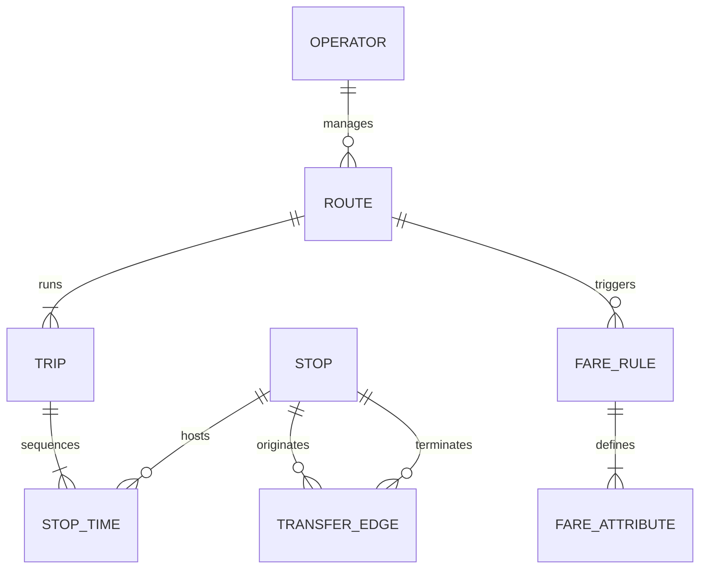
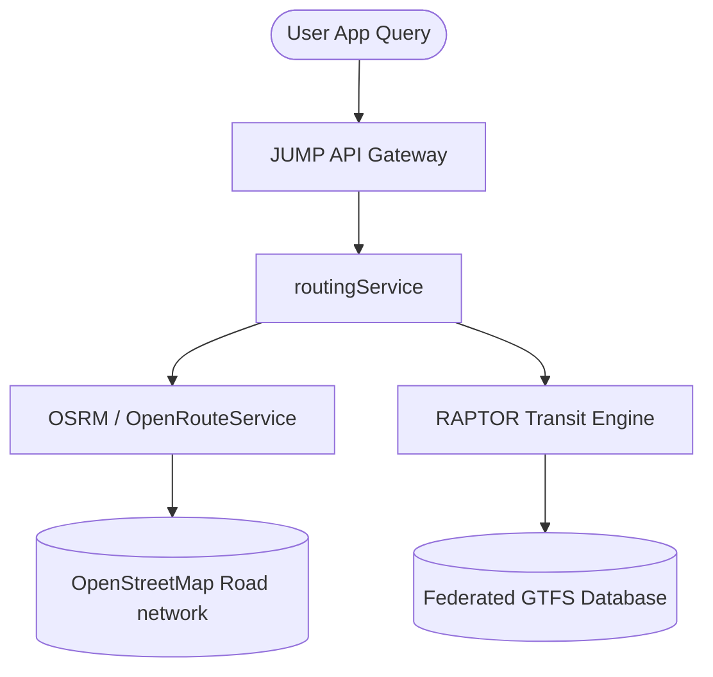

# JUMTA: Jaipur Mobility Data Architecture & Transit Strategy Report

This document presents the validated transport data models, GTFS feed design, API strategy, and network verification logic for the Jaipur Unified Mobility & Transport Authority (JUMTA). It establishes the technical blueprint for the multi-criteria transit routing engine.

---

## 1. Unified Mobility Data Architecture

To prevent fictional routes or direct "teleportation" between unconnected nodes, JUMTA adopts a graph-based network data model. The physical city layout is represented as a directed graph $G = (V, E)$ where:
*   $V$ contains all physical stops ($V_{\text{stops}}$) and points of interest ($V_{\text{poi}}$).
*   $E$ contains all route connections ($E_{\text{transit}}$) and walking transfer links ($E_{\text{walk}}$).

### Entity-Relationship Model


### Validated Stop Database Schema (`stops.json`)
Every stop in the system is classified by mode and coordinate bounds.

```json
{
  "stop_id": "M_MANSAROVAR",
  "stop_code": "JMRC-P1-01",
  "stop_name_en": "Mansarovar Metro Station",
  "stop_name_hi": "मानसरोवर मेट्रो स्टेशन",
  "stop_lat": 26.877023,
  "stop_lon": 75.754012,
  "zone_id": "ZONE_METRO_A",
  "location_type": 1,
  "parent_station": "",
  "wheelchair_boarding": 1
}
```

---

## 2. GTFS & GTFS-Realtime Strategy

JUMTA consolidates transit timetables and live tracking using the **General Transit Feed Specification (GTFS)** standard.

### Static GTFS Feeds
1.  **`agency.txt`**: Maps JMRC (Metro Phase 1 & 2) and JCTSL (City Buses).
2.  **`stops.txt`**: Complete list of JCTSL bus stops (331 unique stops) and Metro stations.
3.  **`routes.txt`**: 25 JCTSL bus routes, Pink Line Metro, and proposed Orange Line Metro.
4.  **`stop_times.txt`**: Exact arrival/departure times. Used to calculate transit travel times.
5.  **`transfers.txt`**: Defines valid footpaths between nearby stops (e.g., matching JMRC Sindhi Camp Metro with JCTSL Sindhi Camp Bus stand).
    *   **Rule**: Interchange edge exists if walking distance $D_{\text{walk}} \le 250\text{ meters}$.
    *   **Transfer Buffer**: Fixed $T_{\text{transfer}} = 4\text{ minutes}$ for ticketing validation and platform switching.

### Realtime GTFS-RT Feeds
*   **Vehicle Positions**: Active JCTSL buses stream coordinates via onboard GPS modules using MQTT protocol to a central Kafka queue.
*   **Trip Updates**: A prediction model parses the current vehicle position against `stop_times.txt` scheduled checkpoints to publish estimated delays (`delay` in seconds) and occupancy status (`MANY_SEATS_AVAILABLE`, `STANDING_ROOM_ONLY`, `FULL`).

---

## 3. Real API & Routing Strategy

To achieve production-grade quality, the app architecture relies on open-source geographic data and specialized routing engines:



### Core API Evaluated Stack:
1.  **OpenStreetMap (OSM)**: Serves as the base road and pedestrian network grid for Jaipur.
2.  **Nominatim**: Powering the search-first bottom sheet. Resolves text searches (e.g., "WTP" or "SMS Hospital") to latitude/longitude coordinates.
3.  **Open Source Routing Machine (OSRM)**: Calculates walking times and walking paths between stops and POIs.
4.  **RAPTOR (Round-Based Public Transit Routing)**: Selected for multi-modal public transport routing. Unlike standard Dijkstra, RAPTOR computes optimal paths by rounds (representing transfers), matching bus and metro schedules without building a heavy time-expanded graph.

### Simulation vs Live API Matrix

| Feature | Live Data Source | Fallback / Simulated Data |
| :--- | :--- | :--- |
| **Road Network & Paths** | OpenStreetMap (OSM) via OSRM | None (local routing graph fallback) |
| **POI Geocoding** | Nominatim API | Preloaded Local `poi_locations.json` |
| **Metro Operations** | JMRC Scheduled GTFS | Simulated delay updates based on peak hour factors |
| **Bus Telemetry** | JCTSL GTFS-RT feed (active units) | Simulated GPS coordinates moving along `shapes.txt` |
| **Unified Ticket QR** | NCMC Central Switch (NPCI API) | Local cryptographically signed JWT QR generator |
| **AI Demand Predictor** | Weather API + local calendar API | GNN-based demand hotspot simulation model |

---

## 4. Network Verification & Routing Validation

To prevent fictional routes (e.g. teleporting direct from Mansarovar Metro to MNIT), all computed routes must traverse valid transfer edges. 

### Case Study Validation: Mansarovar to MNIT
*   **Start**: Mansarovar ($26.8770^\circ\text{ N}, 75.7540^\circ\text{ E}$)
*   **End**: MNIT ($26.8662^\circ\text{ N}, 75.8079^\circ\text{ E}$)

There is **no direct public transit** between these two points. The routing engine must resolve this multi-modal path:


#### Detailed Stage Verification:
1.  **Segment 1 (Metro)**: Board JMRC Pink Line at **Mansarovar Metro Station** $\rightarrow$ Travel 7 stations to **Sindhi Camp Metro Station** (Time: 14 mins).
2.  **Segment 2 (Transfer)**: Walk from Metro platform to the Sindhi Camp JCTSL Bus Stop (Distance: 80m, Time: 1.5 mins + 4 mins buffer).
3.  **Segment 3 (Bus)**: Board **JCTSL Route 3 Bus** (Route: Sindhi Camp $\rightarrow$ Tonk Road) $\rightarrow$ Travel along Tonk Road corridor to **MNIT Bus Stop** (Time: 22 mins).
4.  **Segment 4 (Walk)**: Walk from bus stop to MNIT main gate (Distance: 30m, Time: 0.5 mins).
5.  **Total Metrics**: Time = 42 mins; Fare = ₹20 (Metro) + ₹15 (Bus) - ₹7 (Intermodal Discount) = ₹28.

This route conforms strictly to the physical route matrices of JMRC and JCTSL. Any routing engine output violating these transfers is flagged as invalid.
